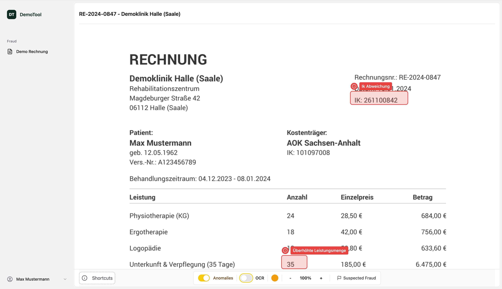

# Document Fraud Review Demo

A demo application for reviewing documents and detecting potential fraud, built with SvelteKit and Svelte 5.

**[Live Demo →](https://fraud-demo.keil.dev/)**



## About This Project

This demo was created in roughly eight hours and includes a few pre-existing components and layouts. The goal was to recreate what I normally build in React (typically using the TanStack ecosystem) using SvelteKit + Svelte 5 instead—and to explore what's changed in Svelte over the last six months.

The application lets users review documents for fraud. A mocked API returns OCR results from a document and flags anomalies for the user to inspect.

## What We Used

| Category      | Technology                                                                               |
| ------------- | ---------------------------------------------------------------------------------------- |
| Framework     | [SvelteKit](https://svelte.dev/docs/kit) + [Svelte 5](https://svelte.dev/)               |
| Styling       | [Tailwind CSS v4](https://tailwindcss.com/)                                              |
| Components    | [Bits UI](https://bits-ui.com/)                                                          |
| Validation    | [Valibot](https://valibot.dev/)                                                          |
| Utilities     | [Runed](https://runed.dev/)                                                              |
| Icons         | [Lucide Svelte](https://lucide.dev/)                                                     |
| Data Fetching | Svelte's [remote functions](https://svelte.dev/docs/kit/load#Remote-functions) (`query`) |

Special thanks to **Bits UI** for making accessible components straightforward to build.

## Architecture

Some of the decisions here might feel like overkill for a demo. That's intentional—if this were the foundation for a real application with multiple developers, having a clear, well-structured front-end architecture becomes important.

This isn't presented as "the right way" to structure a Svelte app. It's one approach I've used successfully on larger projects. Whether it fits your situation depends on your team, your timeline, and how much the codebase is expected to grow.

### Layers

```
src/lib/
├── designSystem/      # Reusable UI building blocks
│   ├── primitives/    # Button, Toggle, etc.
│   ├── page/          # Page layout components
│
├── appShell/          # Application structure
│   ├── layout/        # Layout wrappers
│   ├── sidebar/       # Navigation sidebar
│   └── navbar/        # Top navigation
│
└── module/            # Feature modules
    └── fraud/
        └── document/
            ├── client/   # UI components
            ├── server/   # Data fetching, API, remode functions
            └── domain/   # Schemas, types
```

**Design System** — Contains only reusable UI components with no knowledge of features. These can be extracted to a separate package if needed.

**App Shell** — Defines the application's layout and navigation structure. It can use the design system and import from feature modules.

**Feature Modules** — Each feature is self-contained with three layers:

- `client/` — UI components specific to this feature
- `server/` — Server-side logic and data fetching
- `domain/` — Schemas for models and use-cases, types, and business rules

#### Responsibilities by layer

- **`client/` (UI layer)**  
  UI components for this feature only. It calls **only** the feature’s `server/` endpoints (no direct calls to external APIs).

- **`server/` (BFF layer — Backend for Frontend)**  
  Acts as the feature’s backend boundary. It:
  - calls downstream/internal/external APIs on behalf of the UI
  - aggregates and normalizes data into UI-friendly shapes
  - enforces authentication/authorization and keeps secrets out of the browser
  - uses **HTTP-only cookies** for user sessions and translates them into an internal **JWT (JSON Web Token)** when calling downstream APIs

- **`domain/` (shared contract + rules)**  
  The common source of truth used by both `client/` and `server/`:
  - types and schemas (validation/serialization)
  - use-cases and business rules (where applicable)
  - shared model definitions to keep client and server aligned and avoid duplication

This separation keeps feature code isolated. Multiple people can work on different features without stepping on each other.

For more details, see the full architecture guide:

> **[Frontend Architecture Overview](./doc/ai/architecture.md)**

### Key Patterns


**Schema-first validation** 

Validate all inbound and outbound data with schemas at boundaries (URL ↔ app, app ↔ API). Fail fast at 
integration points rather than surfacing as delayed, hard-to-debug UI behavior

**Remote Functions**

Data fetching uses Svelte's `query` function, which runs on the server and handles serialization automatically. Responses from external APIs are validated with schemas, which also infer the TypeScript ty
+pes.

```ts
export const getDocument = query(v.string(), async (id) => {
	// runs on server, result sent to client
    // validate reponse with schema
});
```

**URL State with Schema Validation**

Viewer settings (OCR visibility, colors, zoom) are stored in URL search params using `useSearchParams` from Runed, validated with Valibot schemas. This makes the viewer state shareable and bookmarkable.

```ts
const searchParams = useSearchParams(searchParamsSchema, {
	showDefaults: false,
	noScroll: true
});
```

**Accessibility**

Accessibility was a priority throughout. Bits UI provides accessible primitives out of the box. Anomaly overlays are sorted in reading order so keyboard navigation follows a logical flow. Keyboard shortcuts are available for common actions.

## AI-Assisted Development

This project was built with AI assistance—not as a moonshot experiment, but as a practical way to move faster. The architecture and structure are not AI-generated; they come from patterns I've used on previous projects.

**[Claude Code](https://claude.ai/code)** (Opus 4.5) handled some of the coding and the commit messages. I added AI-specific documentation covering newer SvelteKit features like remote functions—this helps the model stay current with APIs that may have changed since its training cutoff. I also provided reference implementations and architectural guidance so the AI could follow established patterns rather than invent its own.

For planning, I partially used a **custom agent built on the ChatGPT API**. The workflow for bigger ai tasks: refine the idea, build a base prompt, research. Once the direction was clear, hand it off to Claude Code with clear coding style instructions, examples and guideline and a bigger list what not todo, for implementation—followed by 2-3 rounds of refinement and a final cleanup pass. Around 15 tasks went through this workflow for the demo.

## Running Locally

```bash
pnpm install
pnpm dev
```

## License

This demo is licensed under the **PolyForm Small Business 1.0.0** license.

- ✅ Free for small businesses (<100 people, <$1M revenue)
- ❌ Larger organizations require a commercial license

See `COMMERCIAL-LICENSE.md` for details.
